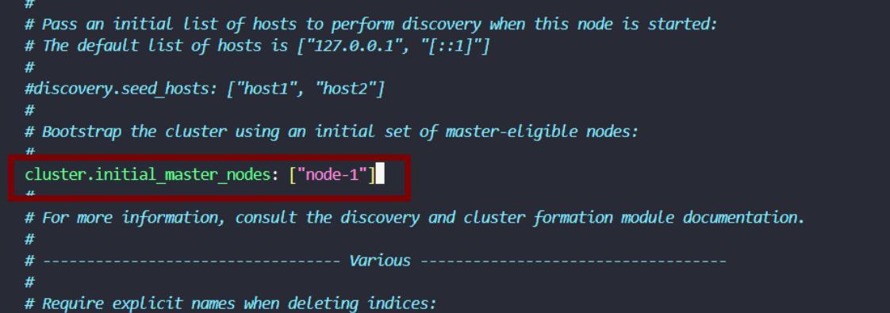
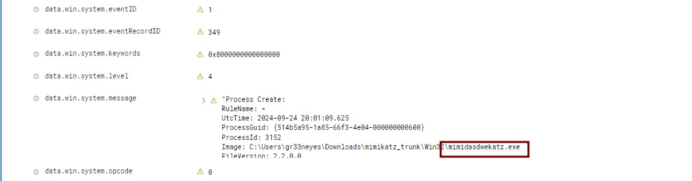
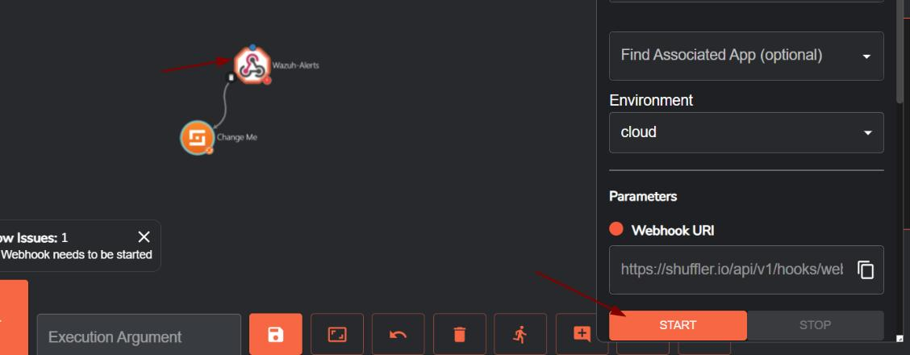
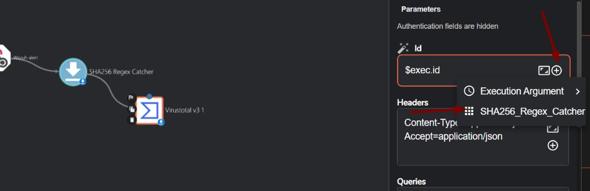

# Project: Wazuh + SOAR + TheHive + Shuffle Automation Deployment on DigitalOcean

This project involves the deployment of a security monitoring and automation stack using Wazuh, TheHive, and Shuffle Automation. The stack is deployed on Digital Ocean droplets, with both Windows and Linux clients connected. For the Windows client, we are using VirtualBox.
Below are the step-by-step instructions to replicate this deployment.

## 1. Pre-requisites
- A Digital Ocean account to create droplets.
- Access to VirtualBox for Windows VM.
- SSH access to the droplets.
- Basic knowledge of working with Linux and VirtualBox.
- Internet connection for downloading necessary software.

## 2. Setting Up the Environment
### 2.1 Windows Virtual Machine on VirtualBox
- Download Windows 10 ISO from the [official site](https://www.microsoft.com/PT-BR/software-download/windows10).
- Create a VirtualBox VM:
  - Allocate 4 GB of RAM and 50 GB of storage.
  - Proceed with a custom installation, selecting "I don’t have a key" during installation.
  - Disable privacy settings if desired.
  - Choose a Domain Controller for login.
    
  

- Install necessary tools:
  - Install Google Chrome.
  - Download and install the Sysinternals Suite.

  

## 3. Setting Up the Droplet Firewall
- Create a firewall in Digital Ocean:
  - Go to **Networking -> Firewalls -> Create Firewall**.
  - Add a rule to allow SSH access only for **your IP address**.
 
  
  
  
  
- Edit Firewall Rules:
  - Assign the firewall to the droplet.
  - Ensure ports 80 and 443 are open for the Wazuh dashboard access.

## 4. Wazuh Manager Installation on Droplet (Ubuntu)
- Update the droplet:
```bash
sudo apt update -y && sudo apt upgrade -y
```

- Install Wazuh:
```bash
curl -sO https://packages.wazuh.com/4.7/wazuh-install.sh && sudo bash ./wazuh-install.sh -a
```

  

- Access Wazuh Dashboard:
  - Use the public IP of the droplet. http://DROPLETIPADDRESS/
  - Make sure ports 80 and 443 are enabled for you to access. Otherwise it will not work.
 
  
  
  


## 5. Deploying TheHive
- Create a new droplet:
  - Ubuntu 22.04 with at least **8 GB RAM**, similar specs as the Wazuh droplet.
- Install TheHive: Follow the instructions provided at this repository:
  - TheHive Install Instructions:
  
  The installation shall be done automatically using our **automated script** to install all necessary packets, compile and configure everything for us.

  **Important**, please run the script as **root** to prevent any privilege problems.

  ```bash
  curl -O https://raw.githubusercontent.com/Nortindev/SOC-Wazuh-SOAR-TheHive-Automation-on-DigitalOcean/refs/heads/main/TheHive_install.sh ; bash TheHive_install.sh
  ```

  The full installation can take around **10-30 minutes**.

  Important: Dont forget to tab enter these screens so it can continue the installation:

  

  

- After the installation is done, now we can configure Cassandra:
  - Edit the Cassandra configuration:
```bash
nano /etc/cassandra/cassandra.yaml
```

  - Set `listen_address` and `rpc_address` to your public IP.
    
  

  
        
  - Update the seed IP in the seed provider section.

  
    
 **5.1 - Additional Steps for Managing Cassandra Service**
 
 We will need to remove the old files from the library, and restart the service.

  1. Stop Cassandra Service:
```bash
systemctl stop cassandra.service
```

  2. Remove Old Cassandra Files:

```bash
rm -rf /var/lib/cassandra/*
```

  3. Restart Cassandra Service:
```bash
systemctl start cassandra.service
```

  4. Check Cassandra Service Status it should be running now:
```bash
systemctl status cassandra.service
```


  **5.2 Configuring Elasticsearch**

  1. Edit Elasticsearch Configuration:
```bash
nano /etc/elasticsearch/elasticsearch.yml
```

2. Uncomment and Set Parameters:
   - Uncomment `cluster.name` and set it to your hostname.
   - Uncomment `node.name` and leave it as is.
   - Uncomment `network.host` and set the port. Remember to open ports 7000 and 9200 in the firewall.


3. Configure Cluster Master Seeds:
   - Uncomment the relevant lines and remove the second seed as only one seed is used for this project. To scale, you can add more nodes to Elasticsearch.



4. Save the File:
   - Save the changes made to `elasticsearch.yml`.

5. Start and Enable Elasticsearch Service:
```bash
systemctl start elasticsearch
systemctl enable elasticsearch
systemctl status elasticsearch
```

6. Verify Cassandra Service:
```bash
systemctl status cassandra.service
```
If all went well, cassandra should still be running. Make sure to check this.


**5.3 TheHive Setup Guide**:

Step 1: Check TheHive Path

```bash
ls -la /opt/thp
```

The directory will be owned by root; we don't want this. Use `chown` to change it to the user created by TheHive during installation to ensure it functions properly.

Step 2: Change Ownership

```bash
chown -R thehive:thehive /opt/thp
```

Now it's correct and more secure.

Step 3: Edit Configuration File

Open the configuration file using `nano`:

```bash
sudo nano /etc/thehive/application.conf
```

Change the hostname and IP address to the public IP and hostname previously set.

Change the application base URL.


Save the file.

Step 4: Start and Enable TheHive

```bash
systemctl start thehive
systemctl enable thehive
systemctl status thehive
```

Note

**Cassandra, Elasticsearch, and TheHive services must be running for TheHive to work.**

## 6. Adding Wazuh Agent (Windows Client)
- Login to Wazuh
- Click AGENTS -> Add NEW AGENT
- Set Wazuh Manager IP as the host (e.g., 142.93.55.98).
- Install Wazuh Agent on Windows:
  - Copy the Wazuh agent installation command and run it in PowerShell as Administrator. After, start the service NET START WazuhSvc
 


  - After, start the service
    
  ```powershell
    NET START WazuhSvc
   ```

  - On VIRTUAL BOX Change the Network Adapter to Bridge Mode to allow communication with the Wazuh server on Digital Ocean.
  - Open required ports (1514 and 1515) in the firewall on Digital Ocean, on the Wazuh Manager to allow the Windows VM to communicate with the Wazuh server.

    Mow Wazuh should connect to the Windows VM


## 7. Generating Telemetry (Windows Client)
- Edit Wazuh configuration file:
  - Find and modify the Wazuh configuration in the following path: `C:\Program Files (x86)\ossec\ossec.conf` and open with notepad.
  - Back up the file before editing.
  - Keep only windows sysmon and active response. It should look like this bellow <local file>


- Restart Wazuh Agent:
  - Restart the Wazuh agent service to apply the changes. This can be done on `WINDOWS -> SERVICES -> RESTART Wazuh`

## 8. Testing with Mimikatz

# NOTE PLEASE DO THIS ONLY IN THE WINDOWS VM FOR TESTING PURPOSES.

- Download Mimikatz:
  - Disable security features such as Windows Defender, and Google Chrome security and download Mimikatz from: `hxxps://github[.]com/gentilkiwi/mimikatz/releases/tag/2.2.0-20220919`.
  - Run Mimikatz on Windows VM and check if the event is captured by Wazuh.


**8.2 Create a Custom rule to capture MimiKatz**

- Go to Wazuh Manager -> Rules -> CUSTOM and create a new rule like this:


- Mitre ID T1003 for credential dumping, event is originalFileName, searches for mimikatz.exe
- Alert level is 15 (max) and custom event must start from 100002

This will catch Mimikatz, with the original file name, even if the attacker changes its name.




## 9. Automating with Shuffle
- Set up [Shuffle Automation](https://shuffler.io/) to integrate with Wazuh for incident response.
- Configure the webhook and add it to Wazuh. Grab the WebHook API key as well.


- Open Wazuh Manager via SSH. Edit the configuration file with nano,
  
 ```bash
  nano /var/ossec/etc/ossec.conf
```

- Modify Wazuh configuration to include a rule to trigger on Mimikatz detection and send alerts via the webhook.


Dont forget to restart manager after changes to ossec.conf.

```bash
systemctl restart wazuh-manager.service

systemctl status wazuh-manager.service
```

- Build the workflow:
  - Use Shuffle to automate the incident response process:
    - On shuffle, start the webhook



Go to Executions and test the workflow, the Mimikatz rule should be triggered by the API integration.


Here is how our workflow is gonna be:

WORKFLOW FOR AUTOMATION

1 - Mimikatz alert sent to shuffle

2 - Shuffle receives mimikatz alert and extract sha256

3 - Check reputation score with virustotal

4 - Send details to Thehive to create alert

5 - Send email to soc analyst to begin investigation


## 10. Integrating VirusTotal in Shuffle Automation

1. **Obtain VirusTotal API Key**:
   - Create an account at VirusTotal and obtain your API key. This can be found under your profile.

2. **Configure Shuffle to query VirusTotal**:
   - In Shuffle, set the HTTP Method to **GET** and use the VirusTotal API to check the reputation of files.
   - Use a **Regex** expression to extract the SHA256 hash from the Mimikatz alert and send it to VirusTotal.
  

  



3. **Configure the request**:
   - Ensure that the request body contains the necessary data, particularly the hash value parsed from the alert.
   - In Shuffle, use the format `LIST` or `$sha256_regex_catcher.group_0.#` as the list for the SHA256 values.

4. **Test the workflow**:
   - Confirm that the workflow correctly fetches reputation data from VirusTotal.

## 11. Integrating with TheHive for Alerts

1. **Log in to TheHive**:
   - Create a new user or organization in TheHive if not already done.

2. **Configure API Key**:
   - In TheHive, generate an API Key for integration. This can be done by creating a SERVICES user, [and generating the API.](https://docs.strangebee.com/thehive/how-to/user-management/)
   - Save the API key and set up a connection between Shuffle and TheHive.

3. **Send Alerts to TheHive**:
   - In Shuffle, set up a workflow that sends the Mimikatz alert data to TheHive. Include the following:
     - The alert summary (e.g., Mimikatz detected on Host).
     - The process ID and command line extracted from Wazuh logs.
     - Severity (e.g., sev 2).
     - Tags such as MITRE ID **T1003** for credential dumping.
    


4. **Full JSON Structure for TheHive Alerts**:
```json
{
  "description": "Mimikatz detected from user $exec.text.win.system.computer",
  "flag": false,
  "pap": 2,
  "severity": 2,
  "source": "Wazuh",
  "sourceRef": "Rule: 100002",
  "status": "New",
  "summary": "Mimikatz activity detected on Host: $exec.text.win.system.computer and the process ID is: $exec.text.win.eventdata.processId and the command line is $exec.text.win.eventdata.commandLine",
  "tags": ["T1003"],
  "title": "Mimikatz Usage Detected",
  "tlp": 2,
  "type": "Internal",
  "date": "$exec.all_fields.data.win.eventdata.utcTime"
}
```

5. **Test the Workflow**:
   - Temporarily open all necessary ports on Digital Ocean Firewall for TheHive (especially port 9000 for TheHive).
   - Rerun the workflow in Shuffle and check that an alert is successfully created in TheHive.
  


## 12. Sending Email Notifications

1. **Configure Email Integration in Shuffle**:
   - After the VirusTotal reputation check and TheHive alert creation, send an email notification to the SOC analyst.

2. **The email should contain**:
   - Host details (e.g., computer name).
   - Time of alert.
   - Severity level.
   - The SHA256 hash and VirusTotal report link.


3. **Verify Email Delivery**:
   - Check that the email is correctly sent and received, and that all details are included.


## 13. Automating SQL Injection Detection and Response

Now for this part of the project, we are going to setup a new machine on DigitalOcean, running UBUNTU + auditd to audit an SQL injection attempt on the server.

**Machine Prerequisites**

- Ubuntu OS
- Atleast 2GB of RAM and 30GB of storage.
- Has Auditd installed.
- Apache installed.
- Install the Wazuh Agent on the Ubuntu Machine, the same way we did with windows, but now to Ubuntu, you can follow these steps

[Wazuh - How to install Agent on all OS](https://documentation.wazuh.com/current/installation-guide/wazuh-agent/index.html)

For the correct fullfilment of the pre-requisites, make sure to check these steps from the official Wazuh documentation, this is the attack that we will emulate and monitor

[Wazuh - Detecting an SQL Injection Attack](https://documentation.wazuh.com/current/proof-of-concept-guide/detect-web-attack-sql-injection.html)

1. **Create SQL Injection Detection Rule in Wazuh**:
   - After the necessary steps are followed in the document, now we will define a rule for detecting SQL injection attacks.
   - Use Wazuh to log and trigger alerts when SQL injection attempts are made. Since Wazuh already got a rule for this, we will use this one: 31103


Integrating Wazuh to the Ubuntu client via API integration, the same way we did to Windows, but with a new rule, grab the API key on Shuffle.
    


2. **Configure Active Response**:
   - Set up an Active Response in Wazuh to block the source IP of the SQL injection attempt. Edit the ossec file on Wazuh Manager. nano /var/ossec/etc/ossec.conf


3. **Add to Shuffle Workflow**:
   - Extend the Shuffle workflow to include:
     - Extracting the source IP from the Wazuh alert.
     - Sending the source IP to VirusTotal for analysis.
     - Blocking the source IP if necessary.
     - Sending the alert to TheHive and notifying the SOC team via email.
    


4. **Test SQL Injection Response**:
   - Simulate an SQL injection attempt on the client machine. From my case, I tried from my Mobile device


As you can see, the first attempt got a 404 error since I don`t have MySQL installed on my Ubuntu client, but the second one was blocked.

Wazuh logs and blocks the IP , active response is working as intended.


Also in the client machine, the firewall rule is automatically added by Active Response.


   - Confirm that the active response blocks the IP and that all steps in the workflow (VirusTotal check, TheHive alert, email notification) are executed correctly.


## 14. Final Testing and Validation

1. **Test with Various Threat Scenarios**:
   - Use different types of attacks (e.g., Mimikatz, SQL Injection) to test the entire Wazuh, TheHive, and Shuffle setup.
   - Ensure all logs are captured, alerts are triggered, and responses are automated correctly.

2. **Monitor and Fine-tune**:
   - Regularly monitor the performance and adjust rules, workflows, and firewall settings as needed.
   - Make sure the automation flow works without interruptions.

This concludes the initial deployment and configuration of the Wazuh + SOAR + TheHive + Shuffle Automation stack. Follow these steps for future customization or to scale your deployment by adding more clients, rules, or automations.
